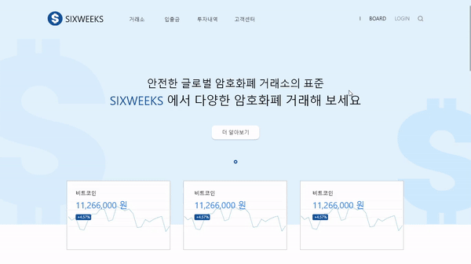

# SIXWEEKS
## 실시간으로 가상 화폐 시세를 받아오는 웹 💸
> 2019 연합인포맥스 인턴

- 디자인 레이아웃


```

📌 실시간으로 가상 화페 시세를 보여줍니다. 

📌 한눈에 보기 쉬운 디자인으로 누구나 편리하게 이용할 수 있습니다.

```

## TEAM (Developer) 👩🏻‍💻👨🏻‍💻
- 김수정 (디자이너/프론트엔드) - [suzumsz](https://github.com/suzumsz)  
- 강동휘 (백엔드) - [kangdonghwi](https://github.com/kangdonghwi)  

## 기능소개 
|  담당자  |   기능설명   |   구현여부   |                              
| :----------: | :----------------: | :----------: |
|김수정| Adobe Photoshop 사용하여 어플리케이션 초기 레이아웃 디자인, Adobe illustrator 사용하여 로고 디자인, Adobe XD 사용하여 어플리케이션 전체 디자인, Bootstrap을 사용하여 전체화면 코딩 | ✔ |
|강동휘| nodeJS를 사용하여 서버관리, mysql로 DB관리, Sequelize를 사용하여 로그인/회원가입/게시판 API 구현, AWS ec2,rds를 사용하여 배포 | ✔ |

## 개발환경
      
   

## 참고
- [디자인 레이아웃 동영상](./etc/디자인레이아웃.mp4) 참고

<details>
<summary> 실행 </summary>
<div markdown="1">

```
npm run dev
```

</div>
</details>
